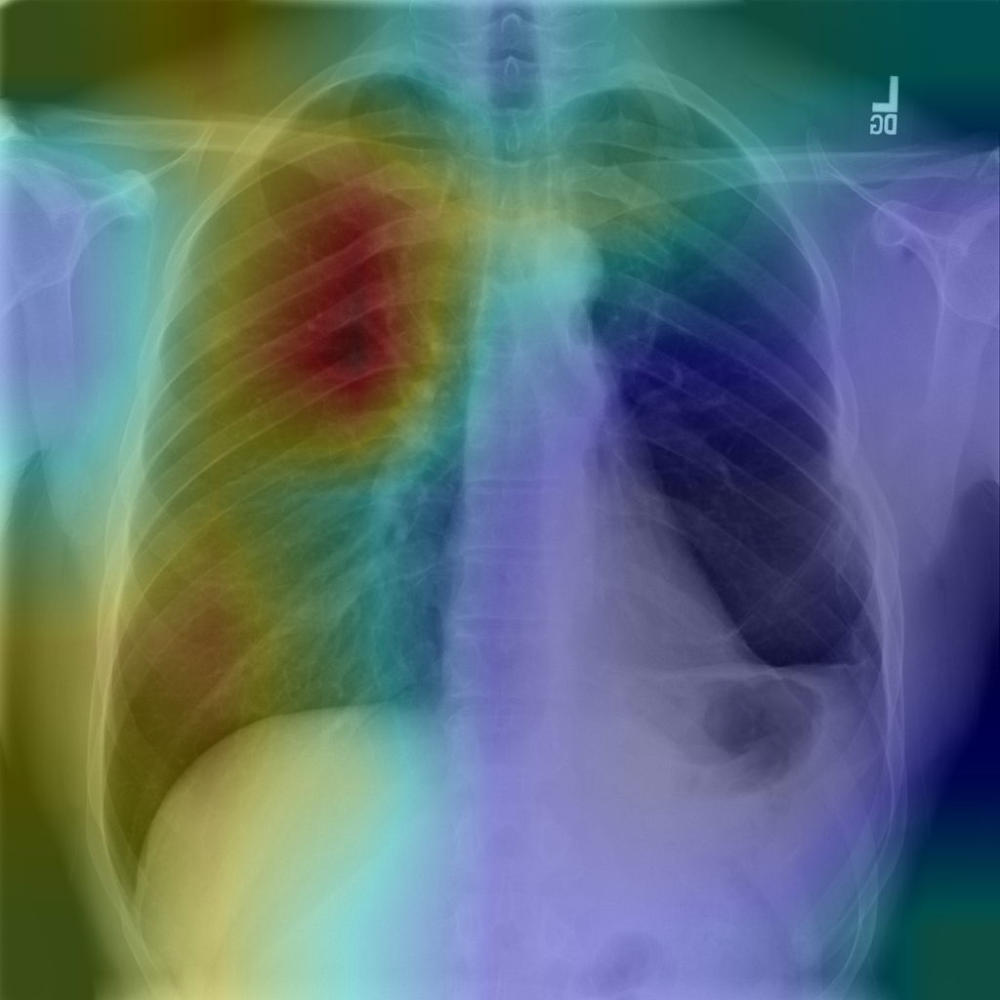

# CheXNet for Classification and Localization of Thoracic Diseases

This is a Python3 (Pytorch) reimplementation of [CheXNet](https://stanfordmlgroup.github.io/projects/chexnet/). The model takes a chest X-ray image as input and outputs the probability of each thoracic disease along with a likelihood map of pathologies.

## Dataset

The [ChestX-ray14 dataset](http://openaccess.thecvf.com/content_cvpr_2017/papers/Wang_ChestX-ray8_Hospital-Scale_Chest_CVPR_2017_paper.pdf) comprises 112,120 frontal-view chest X-ray images of 30,805 unique patients with 14 disease labels. To evaluate the model, we randomly split the dataset into training (70%), validation (10%) and test (20%) sets, following the work in paper. Partitioned image names and corresponding labels are placed under the directory [labels](./ChestX-ray14/labels).

## Prerequisites

- Python 3.4+
- [PyTorch](http://pytorch.org/) and its dependencies

## Usage

1. Clone this repository.

2. Download images of ChestX-ray14 from this [released page](https://nihcc.app.box.com/v/ChestXray-NIHCC) and decompress them to the directory [images](./ChestX-ray14/images).

3. Specify one or multiple GPUs and run

   `python model.py`

## Comparsion

We followed the training strategy described in the official paper, and a ten crop method is adopted both in validation and test. Compared with the original CheXNet, the per-class AUROC of our reproduced model is almost the same. We have also proposed a slightly-improved model which achieves a mean AUROC of 0.847 (v.s. 0.841 of the original CheXNet).

|     Pathology      | [Wang et al.](https://arxiv.org/abs/1705.02315) | [Yao et al.](https://arxiv.org/abs/1710.10501) | [CheXNet](https://arxiv.org/abs/1711.05225) | Our Implemented CheXNet | Our Improved Model |
| :----------------: | :--------------------------------------: | :--------------------------------------: | :--------------------------------------: | :---------------------: | :----------------: |
|    Atelectasis     |                  0.716                   |                  0.772                   |                  0.8094                  |         0.8294          |       0.8311       |
|    Cardiomegaly    |                  0.807                   |                  0.904                   |                  0.9248                  |         0.9165          |       0.9220       |
|      Effusion      |                  0.784                   |                  0.859                   |                  0.8638                  |         0.8870          |       0.8891       |
|    Infiltration    |                  0.609                   |                  0.695                   |                  0.7345                  |         0.7143          |       0.7146       |
|        Mass        |                  0.706                   |                  0.792                   |                  0.8676                  |         0.8597          |       0.8627       |
|       Nodule       |                  0.671                   |                  0.717                   |                  0.7802                  |         0.7873          |       0.7883       |
|     Pneumonia      |                  0.633                   |                  0.713                   |                  0.7680                  |         0.7745          |       0.7820       |
|    Pneumothorax    |                  0.806                   |                  0.841                   |                  0.8887                  |         0.8726          |       0.8844       |
|   Consolidation    |                  0.708                   |                  0.788                   |                  0.7901                  |         0.8142          |       0.8148       |
|       Edema        |                  0.835                   |                  0.882                   |                  0.8878                  |         0.8932          |       0.8992       |
|     Emphysema      |                  0.815                   |                  0.829                   |                  0.9371                  |         0.9254          |       0.9343       |
|      Fibrosis      |                  0.769                   |                  0.767                   |                  0.8047                  |         0.8304          |       0.8385       |
| Pleural Thickening |                  0.708                   |                  0.765                   |                  0.8062                  |         0.7831          |       0.7914       |
|       Hernia       |                  0.767                   |                  0.914                   |                  0.9164                  |         0.9104          |       0.9206       |

## Contributions

This work was collaboratively conducted by Xinyu Weng, Nan Zhuang, Jingjing Tian and Yingcheng Liu.

## Our Team

All of us are students/interns of Machine Intelligence Lab, Institute of Computer Science & Technology, Peking University, directed by Prof. Yadong Mu (http://www.muyadong.com).
